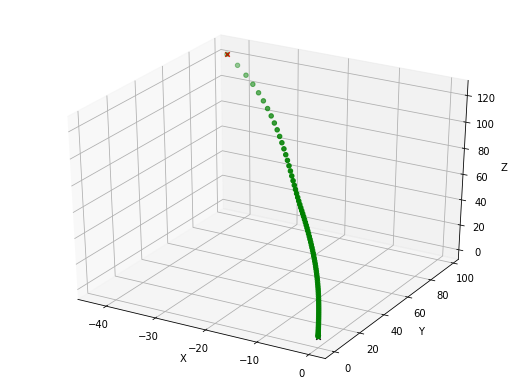

# Quadcopter using Reinforcement Learning

My implementation of the DDPG reinforcement learning algorithm to solve the problem of a quadcopter taking flight.

I have included a reference to the DDPG paper used in the development of the flying agent:

> Continuous control with deep reinforcement learning
> Timothy P. Lillicrap, Jonathan J. Hunt, Alexander Pritzel, Nicolas Heess, Tom Erez, Yuval Tassa, David Silver, Daan Wierstra
>
> We adapt the ideas underlying the success of Deep Q-Learning to the continuous action domain. We present an actor-critic, model-free algorithm based on the deterministic policy gradient that can operate over continuous action spaces. Using the same learning algorithm, network architecture and hyper-parameters, our algorithm robustly solves more than 20 simulated physics tasks, including classic problems such as cartpole swing-up, dexterous manipulation, legged locomotion and car driving. Our algorithm is able to find policies whose performance is competitive with those found by a planning algorithm with full access to the dynamics of the domain and its derivatives. We further demonstrate that for many of the tasks the algorithm can learn policies end-to-end: directly from raw pixel inputs.

## Flight Path

You can see the best take-off that was produced from my reward function and DDPG implementation below:

Although I am partial to [this](./docs/screenshots/try_your_best.png) series of flight paths that occurred during the development phase of this project.

## Notes

_You can see my full analysis of my quadcopter in the [notebook](notebook.ipynb), but a snippet is included below_

I went with take-off in the end, although I did try landing at first. I was having a lot of difficulty getting started with landing, so I switched over to take-off. I think one of the issues with my landing approach was that my reward function was a distance based one, which meant there was no attempt to setup an 'approach'.

I went through a couple of iterations with my reward function, each time implementing a new factor. I split the function into the computation of two components: reward and penalty. I wanted to incentivize the agent into certain behaviours, while discouraging results that were not optimal. I describe it this way, because I wished to reflect these ideas:

- If you are stable, you have a lower penalty.
- If you are reckless (flying sideways), you have a higher penalty.
- The closer you are, the lower the penalty.
- The further you are, the higher the penalty.
- You are rewarded for proximity (cumulative)
- You are rewarded for still flying

These ideas didn't translate well in the end, and in the end only a weighted distance was used for computing the reward. You can see that `reward=0 => abs(0-penalty) = penalty` for the function. This means that most of the code in the get_reward function is not actually needed. The best decision was to ensure that the reward function was normalized, as that made the simulation a lot more consistent between runs.
