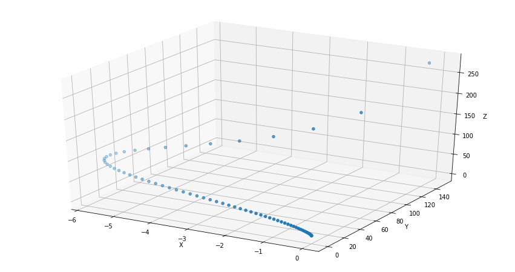

# Quadcopter Take-off

*Teach a Quadcopter How to Fly!*

In this project, you will design an agent to fly a quadcopter, and then train it using a reinforcement learning algorithm of your choice! 

## Results

You can see one of the better flight paths of the quadcopter here:

I would also recommend looking at my [favourite](./docs/screenshots/try_your_best.png) part of teaching a quadcopter to take off.

## Notes
